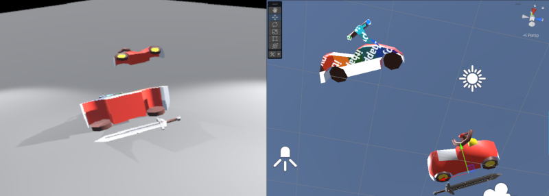

# MeshCutSample

    

## Description / 説明
This Unity project constitutes a prototype implementation of a mesh-slicing algorithm in Unity.
The algorithm is capable of partitioning three-dimensional objects—either non-convex or possessing holes with a genus of zero or greater—into two distinct three-dimensional objects by means of a cutter.

Unity Mesh の切断アルゴリズムの試験実装をおこなった Unity プロジェクトです。
この切断アルゴリズムでは、 種数 が 0 以上のオブジェクトや、非凸多角形オブジェクトを、カッターで 2 つのオブジェクトに分割します。

## Implementation flow / 実装フロー
1. Precompute and store, for each vertex of the pre-sliced mesh, whether it resides on the normal side or the opposite (anti-normal) side of the slicing plane, as determined by the plane equation.  
切断平面を境界にして、切断前のメッシュの頂点が、法線側と反法線側のどちらに存在するかをあらかじめ格納する。

2. Based on the triangle (submesh) data, identify each triangular polygon whose three vertices straddle the slicing plane. Such intersecting polygons are stored in a dedicated polygon buffer class. This buffer performs adjacency-based merge checks between polygons, merging them when possible to prevent unnecessary vertex proliferation.  
Triangle (Submesh) 情報をもとに、三角形ポリゴンを構成する三頂点が、境界平面をまたぐ場合に、切断処理ポリゴンを格納するバッファークラスに格納しておく。(ここで、バッファークラスでは、ポリゴン同士のマージ判定を行い、マージを行うことで頂点の増加を防ぐ。)

3. Using the polygons retained in the buffer, generate new vertices and triangular polygons, and insert them into the post-slice mesh.  
バッファークラスに格納されたポリゴンをもとに新たな頂点と三角形ポリゴンを作成し、切断後メッシュに挿入する。

4. Concurrently with step 3, the vertices lying on the slicing plane are also available. Using these vertices, construct the non-monotone polygon(s) corresponding to the cut face, and decompose each into one or more axis-monotone polygons, following the approach in [1].  
ステップ 3.と同時に切断平面上の頂点も確保できるので、頂点群をもとに、切断面上の非単調多角形を、軸単調な複数の多角形に分割する。[1]

5. For each axis-monotone polygon obtained in step 4, perform triangulation to produce triangular polygons, and insert them into the post-slice mesh.  
ステップ 4.で分割した複数の多角形ごとに三角形ポリゴンを作成し、切断後メッシュに挿入する。

6. Instantiate a new mesh object from the post-slice mesh data, thereby completing the slicing process.  
切断後メッシュで新規オブジェクトを生成し、切断処理を終了する。

## Examples / 例

## Remark / 備考

## References / 参考文献
[1] de Berg, M., Cheong, O., van Kreveld, M., & Overmars, M. (2022). *Computational geometry: Algorithms and applications* (3rd ed., Japanese translation by T. Asano). Kindai Kagaku Sha. / ドバーグ, M., チョン, O., ファンクリベルド, M., & オーバマーズ, M.（著）, 浅野哲夫（訳）. (2022). *コンピュータ・ジオメトリ ― 計算幾何学：アルゴリズムと応用*（第3版）. 近代科学社.